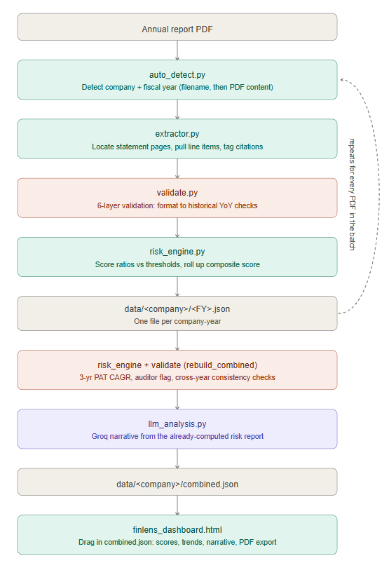

# FinLens — Financial Risk Ledger

Extracts financial data from Indian annual report PDFs (Ind-AS format),
validates it, scores risk against documented thresholds, layers on an
LLM-generated narrative, and renders it all in an interactive dashboard —
every number traceable back to its source page.

## Files

| File | Purpose |
|---|---|
| `config.py` | All company-agnostic config: statement anchor keywords, line-item regex, risk thresholds (industrial + bank), dimension/weight mapping, manual-input metric definitions. Edit this to tune scoring or add new line items — the other files shouldn't need to change. |
| `auto_detect.py` | Detects company + fiscal year. Tries filename convention (`<Company>_FY<YY>.pdf`) first; falls back to PDF content — company via metadata → audit-opinion paragraph → cover-page frequency, fiscal year via the primary balance sheet header. Filters out non-company entities (depositories, e-signing authorities) that can otherwise get mistaken for the reporting company. |
| `extractor.py` | Locates Balance Sheet / P&L / Cash Flow pages by keyword search, pulls line items via regex, tags every value with its PDF page + printed page number for citation, and detects whether a company is an industrial company or a bank (RBI Schedule III format). |
| `validate.py` | Six-layer validation framework run on extracted line items before the risk engine trusts them: (1) format, (2) plausible range, (3) accounting-identity checks, (4) business-logic constraints, (5) year-over-year historical sanity, (6) a re-extraction hook for anything flagged HIGH by layers 1–5. Produces a `validation` report (status + flags with severity, field, message, and source citations) attached to every year record. |
| `risk_engine.py` | Computes ratios from extracted line items, scores each against `config.THRESHOLDS`, rolls up into dimensions (Liquidity, Solvency, Profitability, Operational) and a composite score. Company-type aware — industrial companies and banks use different ratio sets and thresholds. Also handles manual-input scoring (`apply_manual_inputs`) and multi-year metrics like 3-yr PAT CAGR (`build_multi_year_metrics`). |
| `llm_analysis.py` | Generates a plain-English risk narrative (headline, strengths, concerns, data caveats, watch items) via the Groq API. Summarization only — the model is given the already-computed risk report and metrics, never raw PDF text, and is instructed not to invent numbers. Never raises: a missing key, missing package, or network failure degrades to "no narrative this run" rather than breaking the batch. Requires `pip install groq` and a `GROQ_API_KEY`. |
| `batch_extract.py` | The entry point. Processes every PDF in a folder end-to-end (detect → extract → validate → score → apply manual inputs → LLM narrative) and builds a combined multi-year dataset per company, including cross-year validation once 2+ years are available. |
| `manual_inputs_template.json` | Template for the ~16 risk metrics that aren't in an annual report (GST filing delays, litigation count, credit rating, board turnover, etc.) — fill in what you know and it gets folded into the score. |
| `finlens_dashboard.html` | Interactive dashboard — drag and drop `combined.json` files for any number of companies to load them side by side. Shows the composite risk score, dimension breakdown, Chart.js trend charts across years, the AI-generated narrative, validation/cross-year flags, and raw extracted line items with citations. Includes a PDF export button (via `html2pdf.js`). Static HTML, no server needed. |

## Usage

```bash
# 1. Put annual report PDFs in a folder, e.g. /mnt/user-data/uploads
#    (any number, any companies -- company + fiscal year are auto-detected,
#    or named as <Company>_FY<YY>.pdf to skip PDF-content detection)

# 2. Run the batch pipeline
python batch_extract.py /mnt/user-data/uploads data

# This creates, per company:
#   data/<company_slug>/<fiscal_year>.json   -- one file per year, with
#       extracted line items + citations + validation report + risk_report
#       + LLM narrative (llm_analysis)
#   data/<company_slug>/combined.json        -- all years merged, plus
#       multi-year metrics (3-yr PAT CAGR, auditor-change flag) and
#       cross-year validation (once 2+ years are present)

# 3. (Optional) Add manual inputs for non-extractable metrics
cp manual_inputs_template.json data/<company_slug>/manual_inputs.json
# ...fill in what you know...
python batch_extract.py /mnt/user-data/uploads data   # re-run to apply

# 4. (Optional) Enable LLM narratives
export GROQ_API_KEY=...
pip install groq
# re-running the batch will backfill narratives for any year that's
# missing one or whose last attempt errored

# 5. View the dashboard
# open finlens_dashboard.html in a browser and drag in one or more
# data/<company_slug>/combined.json files
```

## Adding a new company

Nothing to change in code. Just add its PDF(s) to the uploads folder and
re-run `batch_extract.py`. Company name and fiscal year are auto-detected;
each company gets its own folder under `data/`.

## Architecture / pipeline flow




`batch_extract.py` is the orchestrator. For each PDF, one company-year
flows through the pipeline like this:

```
PDF file
  │
  ▼
auto_detect.py ─── detect_from_filename()  (tries "<Company>_FY<YY>.pdf" first)
  │                        │
  │                        └─ no match → detect_company_name() +
  │                                       detect_fiscal_year()  (PDF content:
  │                                       metadata → audit opinion → cover
  │                                       page frequency / balance-sheet header)
  ▼
extractor.py ─── run_extraction()
  │   locates Balance Sheet / P&L / Cash Flow pages via config.STATEMENT_ANCHORS,
  │   pulls line items via config.LINE_ITEMS regex, tags each value with its
  │   PDF page + printed page number, and detects company_type
  │   (industrial vs. bank / RBI Schedule III)
  ▼
validate.py ─── validate_scope()
  │   Layer 1 Format → Layer 2 Range → Layer 3 Accounting identities →
  │   Layer 4 Business logic → Layer 5 Historical YoY → Layer 6 re-extraction
  │   hook for anything flagged HIGH
  │   produces: validation report (status + flags, each with severity,
  │   field, message, source citation)
  ▼
risk_engine.py ─── build_risk_report()
  │   computes ratios from extracted line items, scores each against
  │   config.THRESHOLDS (industrial or bank set), rolls up into dimensions
  │   (Liquidity, Solvency, Profitability, Operational) → composite score
  │
  ├── apply_manual_inputs()  — if data/<company>/manual_inputs.json exists,
  │     folds in the ~16 non-extractable metrics (compliance, legal, credit,
  │     governance, reputation) and recomputes the composite
  │
  ▼
year_record written to data/<company_slug>/<fiscal_year>.json
  (company, extracted, validation, risk_report, ...)
```

Once every PDF in the batch has been processed, `rebuild_combined()` runs
once per company across all its year files:

```
all data/<company_slug>/FY*.json
  │
  ▼
risk_engine.build_multi_year_metrics()
  │   3-yr PAT CAGR, auditor-change flag, etc. across years
  ▼
risk_engine.recompute_after_multiyear()
  │   folds multi-year metrics back into the latest year's composite score
  ▼
validate.layer5_cross_year()   (only if 2+ years available)
  │   compares independently-extracted years against each other for
  │   consistency, separate from the single-year Layer 5 check above
  ▼
llm_analysis.generate_llm_analysis()   — per year (backfills any year
  │   missing a narrative or whose last attempt errored)
  │   given ONLY the already-computed risk_report + validation +
  │   (for the latest year) multi_year + cross_year_validation —
  │   never raw PDF text — to generate headline / strengths / concerns /
  │   data caveats / watch items
  ▼
data/<company_slug>/combined.json
  (company, years_available, by_year: {fy: year_record}, multi_year_metrics,
   cross_year_validation)
```

`finlens_dashboard.html` is the terminal consumer: it's a static, serverless
page — drag in one or more `combined.json` files and it renders the
composite score, dimension breakdown, Chart.js trend lines across years, the
LLM narrative, validation/cross-year flags, and the raw extracted line items
with citations, with a PDF export button for the whole view.
